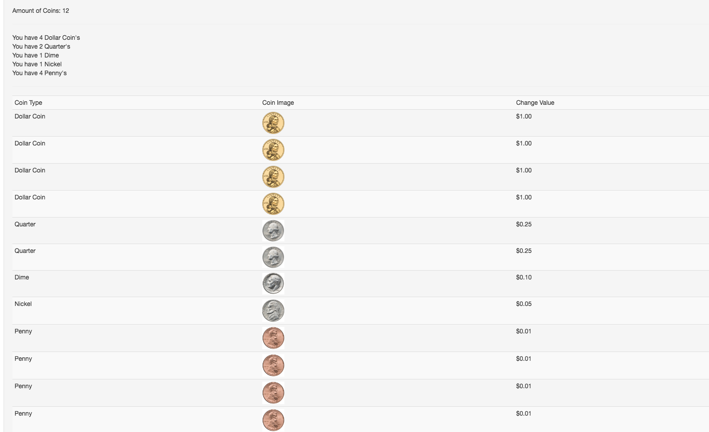

#CashRegister App

##Angular.js, HTML, miniMax, BootStrap, and SASS

###Live Demo:

www.dannyarango.com/cashregister

###Overview of Project

This cash register was a lot of fun to build!  I created two main algorithms which were a lot of fun to develop.  One algorithm goes through a "purse" object and determines (from the highest to lowest value) how many of each coin can be used to match the total change due.  The next algorithm displays how many of each type of coin is there and then displays each indiviual coin needed for the change.

###Built With

Angular
Bootstrap
Javascript
HTML
CSS

###NPMs

npm install angular
npm install boostrap

###SCREENSHOTS

###Things to add

*A carousel to display the change due!

### Contributors

*Danny Arango: http://www.dannyarango.com

